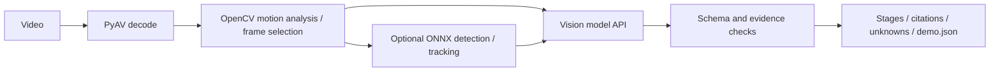
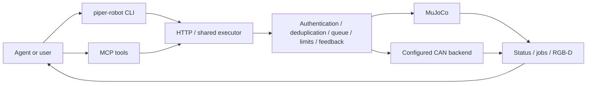

# Piper Policy

[中文](README.md) | [English](README.en.md)

Current robot release: **[0.7.1](https://github.com/Nothing1596/Piper-Policy/releases/tag/robot-v0.7.1)**. Run `piper-robot`, choose simulation and local, then use `/connect`, `/tools`, `/manual tool(arguments)` and `/quit` in one terminal. Manual tools do not need a model API key. [Installation](docs/ROBOT-GUIDE.en.md) · [Task walkthrough (Chinese)](docs/ONE-TASK-DEMO.zh.md) · [Release notes](docs/ROBOT-RELEASE-0.7.1.md).

## Independent releases

[DeepSeek API setup without Codex (Chinese guide; robot 0.6.1 update)](docs/DEEPSEEK-SETUP.zh.md)

**Robot 0.7.1 installation:** prepare Python 3.11+, extract the kit, then run `Setup.cmd` on Windows or `python3 install.py` on macOS/Linux. Dependencies download during installation. Python and PATH registration are not automated; launch the bundled `piper-robot.cmd` / `./piper-robot`. The [older installer add-on](docs/ONE-CLICK-INSTALL.md) applies only to video 0.3.0 / robot 0.6.x.

The video and robot pipelines now ship separately, each with its own CLI and MCP. Each installer creates an isolated `.venv` without requiring the other package.

| Kit | Entry points | Guide |
|---|---|---|
| [Video v0.3.0](https://github.com/Nothing1596/Piper-Policy/releases/tag/video-v0.3.0) | `piper-video` / `piper-video mcp` | [English](docs/VIDEO-GUIDE.en.md) / [中文](docs/VIDEO-GUIDE.zh.md) |
| [Robot v0.7.1](https://github.com/Nothing1596/Piper-Policy/releases/tag/robot-v0.7.1) | `piper-robot` / `piper-robot mcp` | [English](docs/ROBOT-GUIDE.en.md) / [中文](docs/ROBOT-GUIDE.zh.md) |

**Command and feature references:** [Video CLI](docs/VIDEO-CLI-REFERENCE.md) · [Robot CLI](docs/ROBOT-CLI-REFERENCE.md). These bilingual references include command inventories, parameters, defaults, units, examples, MCP tools and actual `--help` output.

### Video architecture



CV reduces the frames to inspect, detection supplies fallible hints, and the vision model interprets grasp, transport, release and final relationships. Citations connect claims to source images and uncertainty remains explicit. This is interpretation, not weight training.

### Robot architecture



The robot kit starts simulation and captures RGB-D without the video package. MCP does not open another CAN owner. After job submission, check its final status and fresh observations. Camera capture currently supports MuJoCo; hardware drivers, SDK and calibration require separate commissioning.

Codex, Claude Code and other agents can connect both MCP servers or invoke both CLIs: inspect demonstration, inspect current scene, act, check feedback and observe again. Historical video does not automatically become hardware commands. See [standalone validation](docs/SPLIT-VALIDATION.md).

## Previous combined v0.2.1 release (retained)

The following versions and commands belong to the original combined kit. Use the guides above for the new standalone kits.

A video demonstration, visual policy, and robot execution toolkit for PiperX. One CLI includes **both upper-level and lower-level controller software**, with local vision models, model APIs, and MCP integration for agents such as Codex and Claude Code.

**[Download the complete package v0.2.1](https://github.com/Nothing1596/Piper-Policy/releases/tag/v0.2.1)** · **[Deployment guide (Chinese)](docs/NEW-MACHINE-GUIDE.md)** · [Release notes (Chinese)](docs/RELEASE-NOTES.md)

## Components

| Component | Version | Purpose and commands |
|---|---|---|
| Upper-level piper-lab | 0.2.1 | Frame selection, demonstration interpretation/storage, model profiles and visual policies; `piper demo / models / policy` |
| Lower-level piperx-middleware | 0.5.0 | Connections, state, job queues, arm/gripper execution, feedback, HTTP/MCP; `piper device` |
| Combined capabilities | Included | MuJoCo simulation, evaluation and MCP tools; `piper sim / eval / mcp` |

The lower-level component runs on the host computer; it is not embedded arm firmware. Installation does not flash firmware, enable hardware, or open CAN.

## Quick start

The complete package requires **Windows x64 / Python 3.12**. Download the release ZIP, extract it, and open PowerShell in the `piper-cli` directory containing `install.ps1`:

```powershell
powershell.exe -NoProfile -ExecutionPolicy Bypass -File .\install.ps1
.\piper.cmd doctor
.\piper.cmd --help
```

The installer verifies SHA256 hashes and installs bundled wheels offline into an isolated `.venv`. Python, vision model weights, LM Studio, agent clients and cloud accounts are separate prerequisites. Install again from the ZIP on each machine; do not copy an installed virtual environment.

Start the simulator in terminal A and leave it running:

```powershell
.\piper.cmd sim start --root work\sim --port 8808 --seed 200
```

Connect and inspect it from terminal B:

```powershell
.\piper.cmd device --root work\sim --url http://127.0.0.1:8808 connect
.\piper.cmd device --root work\sim --url http://127.0.0.1:8808 status
```

No model is needed yet. Then choose a workflow:

- **Pipeline-managed execution:** configure `--model-config` and submit `piper policy run --task ...`. The pipeline captures images, requests structured decisions, validates actions, executes them and checks fresh observations.
- **Agent-managed tools:** connect `piper mcp` to a stdio MCP client. The agent sees current simulation images through `simulation_observe` and invokes robot tools.

Model transports include LM Studio, OpenAI Responses, OpenAI-compatible Chat Completions, Anthropic Messages and Gemini generateContent. Select a model that supports images and the required structured output. Keys come from environment variables. Logged-in Codex/Claude Code CLI sessions are not inference API backends.

The **[deployment guide](docs/NEW-MACHINE-GUIDE.md)** provides full commands, model setup, MCP registration, video processing and troubleshooting in Chinese.

## Repository and development

```text
piper-lab/     Upper-level video/policy/models, ROS bridge, tests and packaging templates
piperx-cli/    Lower-level executor, HTTP/MCP, MuJoCo assets and tests
docs/          Deployment and development documentation
```

Dependency wheels and the installation ZIP are release assets. Model weights, private runtime data and tokens are not committed. See [source development and testing](docs/SOURCE-DEVELOPMENT.md) for the separate source-install workflow.

## Validation scope

- The complete v0.2.1 package installed offline in a fresh environment: **287 upper-level tests passed, 3 skipped**. All 54 installed modules matched source/wheel hashes.
- A fresh MuJoCo instance started, connected, and returned a real 640×480 image plus depth through MCP. This installation check sent no motion commands.
- In a separate live task, the assistant inspected images between stages and completed ten motion/gripper jobs through MCP to place a red block in the green tray. Independent scoring after execution confirmed placement and release.

These are not general task-success rates. API adapters have mocked protocol and compilation-chain tests, not live verification of every cloud account. The autonomous visual policy currently targets 30 mm colored blocks and a green tray in MuJoCo. Independent temporal human annotations, arbitrary-object transfer and real-hardware visual control remain unaccepted. Demonstration processing creates referenceable memory; it does not update model weights.

## Third-party content

Assets and dependencies retain upstream provenance and licenses; see [THIRD-PARTY.md](THIRD-PARTY.md). No repository-wide open-source license has yet been declared for all original code. Public visibility does not grant additional permissions by itself.
