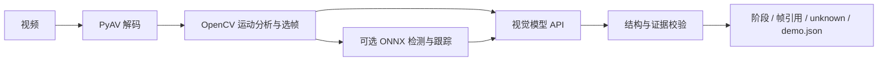
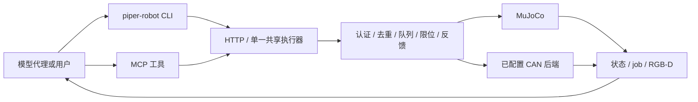

# Piper Policy

单终端重构的启动、审批和远程连接说明见 [Robot 交互指南](docs/ROBOT-INTERACTIVE.zh.md)。软件与平台验证范围单独列在 [验证记录](docs/implementation/validation.md)。

[中文](README.md) | [English](README.en.md)

## 独立发行版

[无需 Codex：DeepSeek API 配置步骤（下位机 0.6.1 更新）](docs/DEEPSEEK-SETUP.zh.md)

**[Windows 一键安装与 CLI 注册](docs/ONE-CLICK-INSTALL.md)**：双击 `Setup.cmd`，自动处理 Python、虚拟环境和依赖，注册用户 PATH。原独立 ZIP 可使用小型安装补充包。

视频管线和下位机管线现在分别发布，各有 CLI 和 MCP。两个安装器各自创建 `.venv`，无需安装另一包。

| 安装包 | 独立入口 | 部署向导 |
|---|---|---|
| [视频 v0.3.0](https://github.com/Nothing1596/Piper-Policy/releases/tag/video-v0.3.0) | `piper-video` / `piper-video mcp` | [中文](docs/VIDEO-GUIDE.zh.md) / [English](docs/VIDEO-GUIDE.en.md) |
| [下位机 v0.6.0](https://github.com/Nothing1596/Piper-Policy/releases/tag/robot-v0.6.0) | `piper-robot` / `piper-robot mcp` | [中文](docs/ROBOT-GUIDE.zh.md) / [English](docs/ROBOT-GUIDE.en.md) |

**命令与功能参考：** [视频 CLI](docs/VIDEO-CLI-REFERENCE.md) · [下位机 CLI](docs/ROBOT-CLI-REFERENCE.md)。包含完整命令索引、参数、默认值、单位、调用示例、MCP 工具和实际 `--help` 输出。

### 视频管线结构



CV 缩小需要看的帧范围，检测器提供可能有误的目标线索，视觉模型解释抓取、搬运、释放和最终关系。证据引用连回原片，不确定时保留 unknown。这是示范解析，不是更新模型权重。

### 下位机管线结构



下位机包独立提供仿真启动和 RGB-D 取图，不安装视频解析包。MCP 不另占 CAN。动作返回 job_id 后还需查询完成状态、再看当前画面。取图工具当前支持 MuJoCo；真机 SDK、驱动和标定需另行部署验收。

Codex、Claude Code 等代理可以同时连接两个 MCP，或者直接调用两个 CLI：读示范 → 看当前场景 → 调动作工具 → 查反馈 → 再看图。视频历史不会直接转换为机械臂指令。见 [独立包验收](docs/SPLIT-VALIDATION.md)。

## 原联合版 v0.2.1（保留）

以下是原联合包的命令和版本。新独立包请使用上面的专用向导。

面向 PiperX 的视频示范处理、视觉策略与机器人执行工具链。统一 CLI 同时包含**上位机和下位机软件**，支持本地视觉模型、模型 API，以及 Codex / Claude Code 等代理的 MCP 接入。

**[下载完整安装包 v0.2.1](https://github.com/Nothing1596/Piper-Policy/releases/tag/v0.2.1)** · **[详细部署向导](docs/NEW-MACHINE-GUIDE.md)** · [版本说明](docs/RELEASE-NOTES.md)

## 包含的组件

| 部分 | 版本 | 功能与入口 |
|---|---|---|
| 上位机 piper-lab | 0.2.1 | 视频选帧、阶段解析、示范存储、模型配置和视觉策略；`piper demo / models / policy` |
| 下位机 piperx-middleware | 0.5.0 | 连接、状态、作业队列、运动与夹爪执行、反馈、HTTP/MCP；`piper device` |
| 联合能力 | 同包提供 | MuJoCo 仿真、评测、MCP 工具；`piper sim / eval / mcp` |

这里的下位机是运行在计算机上的控制软件，不是机械臂内部固件；安装不会刷固件、自动使能或连接 CAN。

## 快速开始

完整包适用 **Windows x64 / Python 3.12**。下载 Release ZIP，解压后进入包含 `install.ps1` 的 `piper-cli` 目录：

```powershell
powershell.exe -NoProfile -ExecutionPolicy Bypass -File .\install.ps1
.\piper.cmd doctor
.\piper.cmd --help
```

安装器核对 SHA256，从包内 wheel 离线安装到独立 `.venv`。Python、视觉模型权重、LM Studio、代理客户端和云端账户需要另外准备。新机器重新解压安装，不复制已有 `.venv`。

终端 A 启动仿真并保持运行：

```powershell
.\piper.cmd sim start --root work\sim --port 8808 --seed 200
```

终端 B 连接和检查：

```powershell
.\piper.cmd device --root work\sim --url http://127.0.0.1:8808 connect
.\piper.cmd device --root work\sim --url http://127.0.0.1:8808 status
```

此时不需要模型。后续选择一种方式：

- **管线自主执行**：配置 `--model-config`，使用 `piper policy run --task ...`。管线取图、请求结构化决策、校验动作、执行，再复核新画面。
- **代理使用工具**：将 `piper mcp` 接入支持 stdio MCP 的客户端，代理用 `simulation_observe` 看图，再调用机器人动作工具。

模型接口支持 LM Studio、OpenAI Responses、OpenAI 兼容 Chat Completions、Anthropic Messages 和 Gemini generateContent。所选模型必须支持图片及相应结构化输出；密钥从环境变量读取。Codex/Claude Code 的登录会话不作为推理 API 后端。

完整命令、模型设置、MCP 注册、视频处理及排障见 **[新机器部署向导](docs/NEW-MACHINE-GUIDE.md)**。

## 仓库与开发

```text
piper-lab/     上位机、视频/策略/模型适配、ROS 桥、测试和打包模板
piperx-cli/    下位执行器、HTTP/MCP、MuJoCo 资产及测试
docs/          部署和开发说明
```

依赖 wheel 和安装 ZIP 放在 Release；仓库不存放模型权重、私人运行数据或 token。[源码开发与测试](docs/SOURCE-DEVELOPMENT.md)使用独立的安装步骤。

## 验证范围

- v0.2.1 完整包在全新环境离线安装；上位测试 **287 通过、3 跳过**，54 个安装模块与源码/wheel 一致。
- 新建 MuJoCo 实例的启动、连接及真实 MCP 返回 640×480 图像/深度通过；该安装检查没有发送运动。
- 另一次实际任务中，助手分阶段看图，通过 MCP 完成十个运动/夹爪作业，把红块放入绿色托盘；动作结束后的独立物理评分确认入盘且已松爪。

这些结果不是所有任务的成功率。API 适配做过协议模拟和编译链测试，尚不代表每个云供应商账户已真实验证。自主视觉策略当前针对 MuJoCo 的 30 mm 彩块和绿色托盘；真人独立时间标注、任意物体迁移及真机视觉闭环尚未完成验收。示范处理形成可引用的记忆，不更新模型权重。

## 第三方内容

资产和依赖保留上游来源及许可，见 [THIRD-PARTY.md](THIRD-PARTY.md)。本仓库尚未为所有原创代码声明统一开源许可证；公开可见不自动构成额外许可授权。
